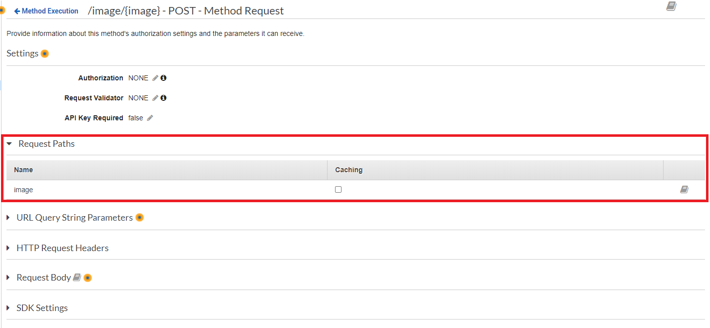

# Setup SaaS - Boas Vindas para Escritórios de Advocacia - AWS

Aplicação de Boas Vindas para novos clientes da Oferta Saas para Escritórios de Advocacia. 
Esta aplicação foi construida pensando na integração com a AWS

## Pré requisitos
------

Existem algumas parametrizações que devem ser feitas antes de subir o projeto em produção. Para isso é necessário que tenha instalado em seu computador alguns programas.

### AWS

Para utilizar a solução construimos a seguinte infraestrutura


----

### 1. Bucket - S3

O Bucket será utilizado para armazenar as imagens e os JSON com as informações inseridas pelos novos clientes

---

### 2. Lambda

Criar uma Lambda para receber o seguinte código:

```python
import json
import base64
import boto3
import os
from urllib.parse import unquote

response  = {
    'statusCode': 413,
    'headers': {
        'Access-Control-Allow-Origin': '*',
        'Access-Control-Allow-Credentials': 'true'
    },
    'body': ''
}


def lambda_handler(event, context):
    
    s3 = boto3.client("s3")
    keyImage = unquote(event['pathParameters']["image"])
    fileContent = event["body"]
    decodeContent = base64.b64decode(fileContent)
    bucketName= os.environ['UploadBucket']
    
    try: 
        s3Upload = s3.put_object(Bucket=bucketName, Key=keyImage, Body=decodeContent)
        
        s3_response = s3.put_object(Bucket=bucketName, Key=keyImage, Body=decodeContent)
        response['statusCode'] = 200
        response['body'] = '{ "message": "Your file has been uploaded"}'
        return response
    
    except Exception as e:
        raise IOError(e)

```

A lambda é responsável por receber a Imagem (em bytes) e criar o arquivo dentro do Bucket de JSON/Imagem.

Ao cadastrar o Lambda é necessário informar a variável de ambiente `UploadBucket` que deve ser preenchida com o Id do Bucket criado no passo anterior.


---

----

#### 3. API Gateway

O API Gateway será o responsável por distribuir as requisições para as rotas sem que criemos uma aplicação de Backend. Antes de criar as rotas é necessário informar a configuração `Binary Media Types` para que o API Gateway se prepare para receber os Logos corretamente.


Outra configuração importante é a criação do método HTTP `OPTIONS` nos recursos que iremos criar por conta do CORS. Neste link é possivel entender como [aplicar o CORS nos resources](https://docs.aws.amazon.com/pt_br/apigateway/latest/developerguide/how-to-cors.html).

##### 1- Imagem

O _Path_ para o envio das imagens necessita de um _Pathparam_ `{image}` que irá receber o código do cliente concatenado com a extensão da imagem original.


Em que iremos implementar o _Pathparam_  para a imagem no `Method response`



No passo do `Integration Request` é necessário vincular a função Lambda criada no passo anterior. 

**Importante**: A flag `Use Lambda Proxy Integration` tem de estar ativa, caso contrário a Lambda não conseguirá interpretar o Binário da imagem.


Pela configuração de Proxy da Lambda estar ativa a caixa de `Integration Response` estará desabilitada pois ele passa a receber a resposta da Lambda inves precisar de um `Mapper`.

Na caixa `Method Response` é necessário informar as Tags `ETag` e `Access-Control-Allow-Origin`


----

##### 2- JSON

O _Path_ para envio do JSON é mais simples. Consiste somente do _Path_ que desea informar e o método `PUT` conforme imagem abaixo:


Para o _Path_ JSON podemos deixar o `Method Request` da forma que foi criado.

Para o passo do `Integration Request` precisamos informar que iremos integrar diretamente com o `S3` sem precisar de uma `Lambda` para tratar os dados


- Para `Integration type` informar `AWS Service`
- Para `AWS Service` informar `Simple Storage Service (S3)`
- Para `HTTP Method` informar `PUT`
- Para `Path Override` informar `< Nome do Bucket >/{objectKey}`. O `objectKey` será substituido pelo código do cliente que enviamos via JSON

No `Execution Role` é importante informar uma Role que tenha acesso ao S3 para realizar a [criação de arquivos no `Bucket`](https://docs.aws.amazon.com/pt_br/AmazonS3/latest/API/API_PutObject.html#note).

Mais abaixo no `Integration Request` temos a parte de Mapeamento. Esta parte precisa conter o mapping para `application/json`. A Flag `Request body passthrough` é recomendada estar como _Never_ para evitar outros tipos de conteudo passando para o S3.


Após criar o Mapping irá aparecer abaixo uma caixa de texto. Informe o código abaixo e salve a alteração

```js
#set($context.requestOverride.path.objectKey = $input.json('codigoCliente').replaceAll('"','') + ".json")
$input.body
```

Na caixa `Integration Response` precisamos informar o mapeamento da resposta. Adicione um novo `Modelo de Mapeamento` (Mapping Template)
E coloque o código abaixo: 

```js
#set($context.responseOverride.access-control-allow-origin = "*")
{
    "context": "$context",
    "body": {
        "response": "Json criado com sucesso!"
    }
}

```

As informações do `Integration Response` tem de estar conforme a imagem abaixo


Na caixa do `Method Response` é necessário incluir nos Headers o `ETag` e o `Access-Control-Allow-Origin`.


##### 3- URL do API Gateway

Após implementar os Paths é necessário realizar o deploy das alterações. Para isso vá `Actions`, `Deploy API`. Se não houver um `stage` criado, informe um nome. Após o deploy será informado qual a URL do API Gateway no topo da tela como `Invoke URL`. Essa URL será utilizada junto com os Paths para subir as informações.


---
## APP Angular - SetupSaasAws

Após criar a infraestrutura na AWS é necessário informar no app angular os endpoints criados para envio das solicitações `image` e `json`.

Ao baixar a ultima versão estável na pasta `assets` é possivel encontrar o arquivo `config.prod.json`. Informe a url do endpoint de `image` no `urlLogoUpload` e o `json` no `urlJSonInfo`.

**Importante**: No `urlLogoUpload` inclua até o path sem o `{image}`, isso será informado pelo sistema no momento do upload.

---
## Envio do portal para o cliente

Para enviar ao cliente utilize a url em que o projeto foi hospedado e no final da URL inclua `?id=<id do cliente>`. Com isso o portal irá identificar o código do Cliente e irá utilizar o mesmo para nomear os arquivos no Bucket S3. Ou seja, se for passado `http://setup.advaws.totvs.com.br?id=T01PH12`, ao finalizar o cadastro os arquivos no Bucket serão `T01PH12.json` e `T01PH12.<extensão original do logo>`.

---
### No desenvolvimento

Durante o desenvolvimento do app foi criado um Bucket S3 separado para armazenar o app e hospedar ele. Para isso foi necessário ir em `Properties` e no final da pagina é possivel encontrar a opção `Static website hosting`. Ao ativar ele irá fornecer uma url para acesso externo.

